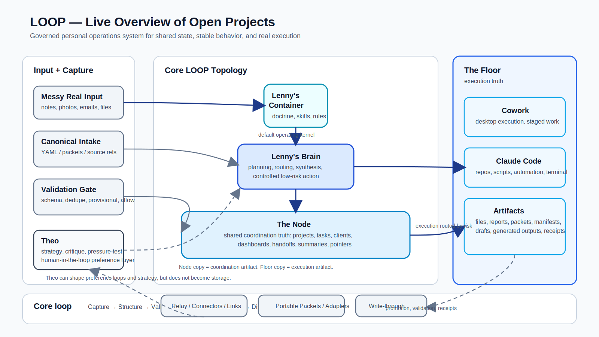

# LOOP
**Live Overview of Open Projects**

> A second brain for execution, not just storage.

LOOP is my attempt at building a system that can take messy real-world input and turn it into structured, usable, evolving operational context.

Most project systems are good at one part of the job:
- capture
- planning
- documentation
- task tracking
- automation

LOOP is trying to connect all of them without pretending they are the same thing.

It is not finished.
Some parts are sharp.
Some parts are still being figured out in public.

I’m sharing it because I think the architecture is interesting, it already works in real use, and feedback will make it better.



**Start here:**
- [Topology overview](docs/architecture/loop-topology.md)
- [Docs index](docs/README.md)
- [AutoResearch integration plan](docs/roadmap/autoresearch-integration-plan.md)

---

## What LOOP means

**LOOP = Live Overview of Open Projects**

The goal is simple:

> keep the real state of active work visible, structured, and connected across tools, agents, and artifacts.

---

## Core model

LOOP is built around a layered architecture:

- **The Node** → shared coordination truth
- **The Container** → stable doctrine, skills, and behavior-shaping context
- **The Floor** → real execution, files, repos, scripts, and local side effects

Supporting roles sit around that core:

- **Theo** → strategy, critique, architecture pressure-testing
- **Lenny’s Brain** → planning, routing, synthesis, controlled low-risk action
- **Cowork / Claude Code** → structured execution on the Floor
- **The Relay / Connectors** → integrations and automation surfaces

Two core rules matter a lot here:

> planning is not execution

> distill, don’t duplicate

The same thing can appear in more than one layer only when each copy is doing a different job.

---

## Why this exists

Most systems fall apart somewhere between:
- rough ideas
- partial notes
- execution
- handoffs
- “what was actually decided?”

I kept running into the same problems:
- context getting lost across chats and tools
- work duplicated in multiple places
- plans pretending to be execution
- notes that were technically saved but operationally dead

So I kept iterating toward a system that separates:
- shared state
- operating rules
- execution surfaces

That became LOOP.

---

## Real example

One of the practical tests for LOOP was simple:

Could it take a rough handwritten project dump and turn it into usable structured system state?

In practice, the answer was yes.

A handwritten notebook page containing:
- client names
- partial scopes
- equipment references
- contact cues
- follow-up hints

was pushed through a structured intake contract and used to generate project context that could connect to:
- clients
- project types
- system types
- priorities
- next actions
- import notes
- AI scope summaries

The interesting part is not just immediate cleanup.

It is **future compounding context**.

---

## What makes LOOP different

The useful difference is not just “AI”.

It is **boundary discipline**.

LOOP tries to stay strict about:
- where shared truth lives
- where behavior rules live
- where execution truth lives
- what has actually been executed vs only planned
- what should be promoted vs kept provisional
- how raw output becomes reusable infrastructure

---

## Current state

Right now this repo represents a system that is:
- real
- evolving
- partially formalized
- already useful
- not yet finished

This is not a polished framework drop.
It is a working system being cleaned up and made shareable.

---

## Repo structure

```text
assets/
docs/
  architecture/
  roadmap/
README.md
CONTRIBUTING.md
```

This is intentionally lean for the first public push.

---

## Feedback welcome

This repo is being shared in a pretty honest state.

Some parts are well-shaped.
Some parts are rough.
A few decisions were made because they kept working in practice, not because they emerged from perfect theory.

If you’ve built:
- second-brain systems
- agent workflows
- structured knowledge pipelines
- personal operating systems
- human-in-the-loop automation

I’d genuinely like feedback on:
- weak assumptions
- architecture boundaries
- where the system is overbuilt
- where it is underbuilt
- what should be made more portable
- what should stay opinionated

Useful > polite.
